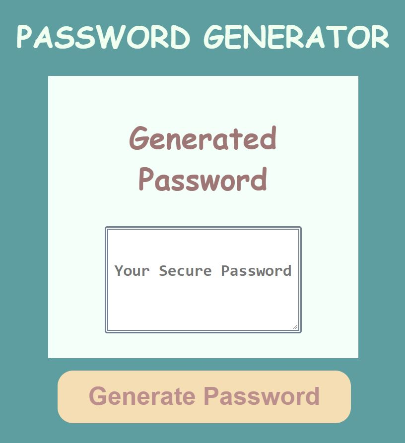

# Password-Generator

## User Story

A command line application run on a browser that will generate a secured random password using specfic criteria.

## Acceptance Criteria

The user clicks the button they will be prompted to answer a series of questions that will generate a password and published to the browser page.

## Mock-up

## Installation

* Visual Studio Code
* HTML
* CSS
* JavaScript
* Bootstrap

## Links

Github: <https://github.com/SarahKubik/Password-Generator.git>

URL: <>
